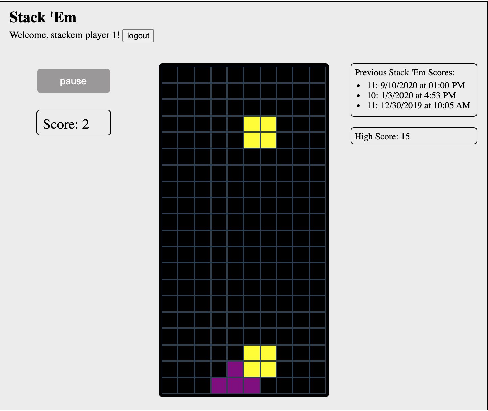
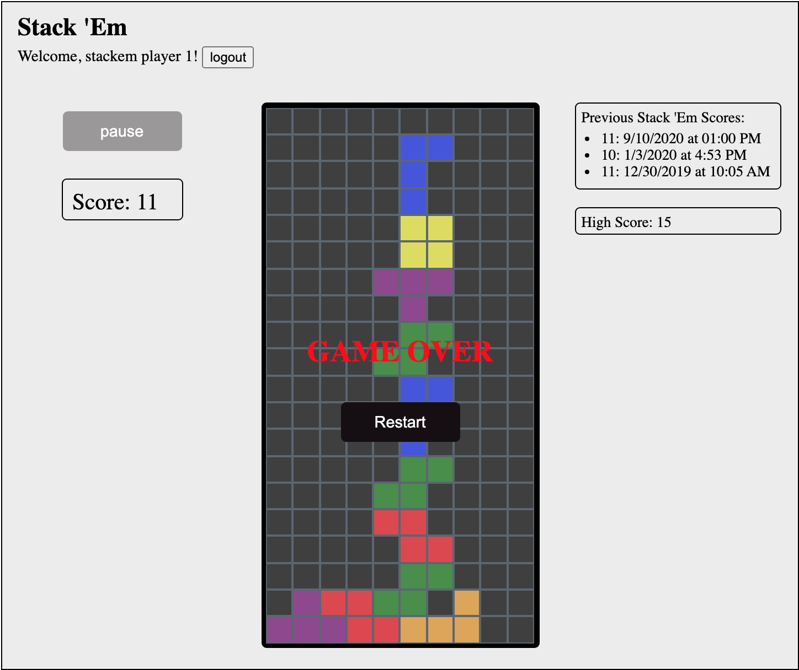

# StackEm-FrontEnd

_Developed by Nick Telenson_ 

# Preview

[Check out a video demo of the app](https://www.loom.com/share/e778244a6a07420884a56f769f2835bc)

StackEm is a single player game mimicking tetris functionality. A player logs in to an account, clicks start, and stacks as many blocks as possible until reaching the top of the tetris board. One point is added for each tetris block stacked. Your score is the number of blocks stacked.

Your highest score is saved and displayed next to the testris board, along with your score to previous games.

<!-- link to demo video -->

## Table of Contents
* [Features](#features)
* [Getting Started](#getting-started)
* [Preview](#preview)

# Features

* Rails REST API backend. 
* Utilizes ES6 for all game animations and custom CSS for styling.

## Built With

* JavaScript
* Ruby on Rails API
* HTML5 and CSS

# Getting Started

Open index.html file in web browser.

Please find the repo for the backend at [StackEm-Backend](https://github.com/ntel-91/StackEm_Backend). You'll first need to follow the instructions on the README for the API in order to spin up the server. Note: the API calls require you to start the Rails server on port 3000 to communicate with the front end `rails s -p 3000`

## Prerequisites 

Clone down this repo after you have the backend cloned and the server running.

